# DevOps + AIOps Series

> A full end-to-end DevOps project with AIOps integration — so you can connect the dots between how AI is helping automate DevOps tasks today.

---

# Project Overview

This project demonstrates a complete cloud-native DevOps workflow using Docker, Kubernetes, AWS EKS, Terraform, GitOps, Prometheus, Grafana, and ArgoCD.

The project simulates a real-world e-commerce microservices architecture where multiple backend services communicate with each other through an API Gateway and are monitored using observability tools.

The application was first deployed locally using Docker Compose and later migrated to AWS EKS using Kubernetes.

GitOps automation was implemented using ArgoCD, while infrastructure provisioning was automated using Terraform.

The project also includes monitoring and observability using Prometheus and Grafana.

---

# Architecture

```text
User Browser
   ↓
React Frontend
   ↓
API Gateway
   ↓
Backend Microservices
   ├── Auth Service
   ├── Product Service
   ├── Order Service
   ├── Orders Management
   └── User Service
   ↓
PostgreSQL Database

Monitoring:
Microservices → Prometheus → Grafana

Cloud Deployment:
Docker Images → AWS ECR → AWS EKS

GitOps:
GitHub → ArgoCD → EKS
```

---

# Screenshots

## Docker & Local Setup

### Docker Containers Running

Docker Compose was used to start all microservices together in containers.

```bash
docker-compose up -d --build
```

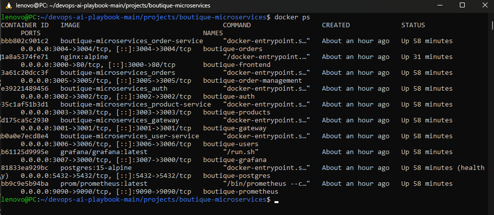

---

### Local Frontend Running

The frontend application was successfully hosted locally and connected with backend services.

Application URL:

```text
http://localhost:3000
```

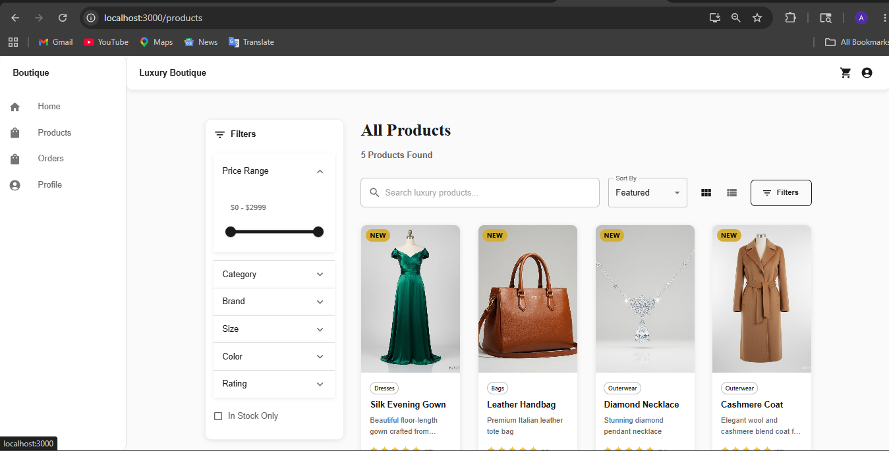

---

### Prometheus Monitoring

Prometheus collected metrics from all microservices and monitored service health.

Query used:

```text
up
```

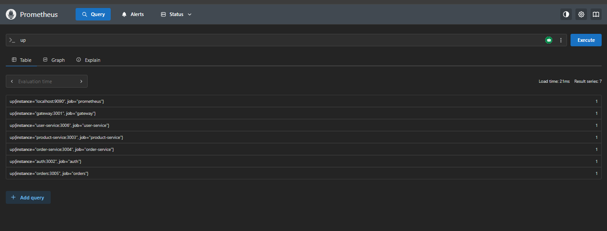

---

### Grafana Dashboard

Grafana visualized Prometheus metrics using dashboards and graphs.

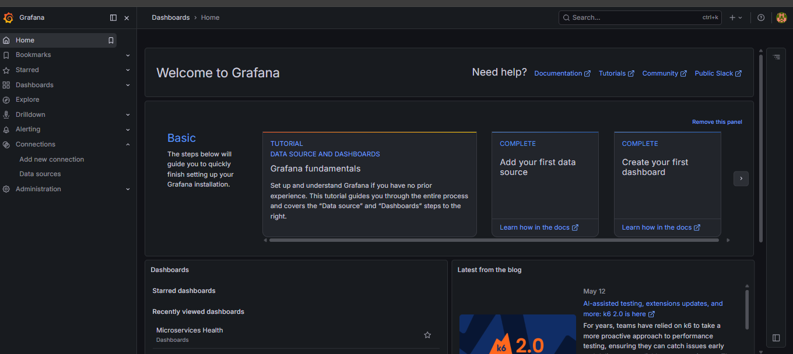

---

# Project Structure

### Project Folder Structure

The repository was organized into infrastructure, Kubernetes, monitoring, and microservices folders.

---

### Docker Compose Configuration

Docker Compose managed all local services, networking, and volumes.

---

### Docker Build Success

Docker images were successfully built for all services.

---

# AWS ECR

---

### AWS ECR Repositories

AWS ECR stored Docker images for Kubernetes deployment.

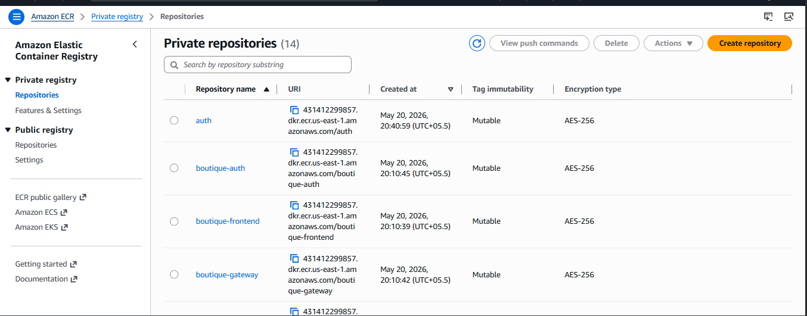

---

### Docker Image Push Success

Docker images were tagged and pushed to AWS ECR successfully.

```bash
docker build
docker tag
docker push
```


---

# Terraform + AWS EKS

### Terraform Apply Success

Terraform provisioned the complete AWS infrastructure automatically.

Resources created:

* VPC
* Subnets
* IAM Roles
* EKS Cluster
* Security Groups
* EBS CSI Driver

```bash
terraform apply
```
---

### EKS Cluster Running

Amazon EKS hosted the Kubernetes cluster for production-style deployment.

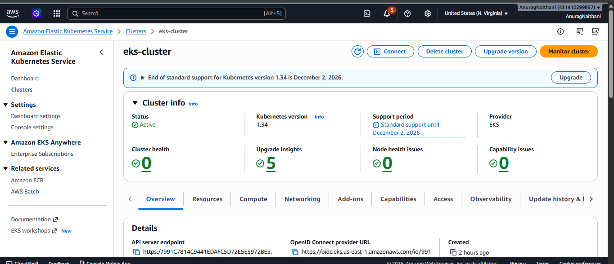

---

### Kubernetes Pods Running

All microservices were deployed successfully inside Kubernetes.

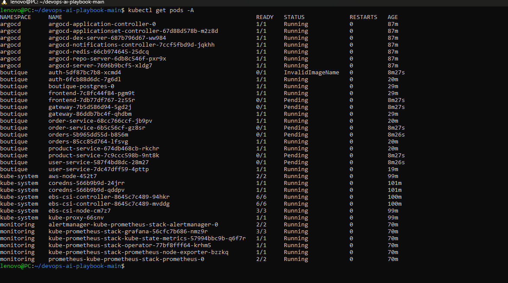

---

### Boutique Namespace Pods

All application services were deployed inside the boutique namespace.

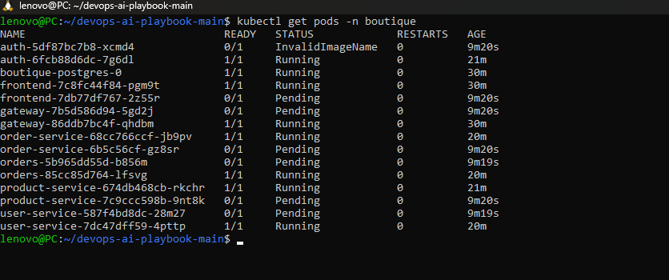

---

### Kubernetes Services

Kubernetes Services provided stable communication between microservices.

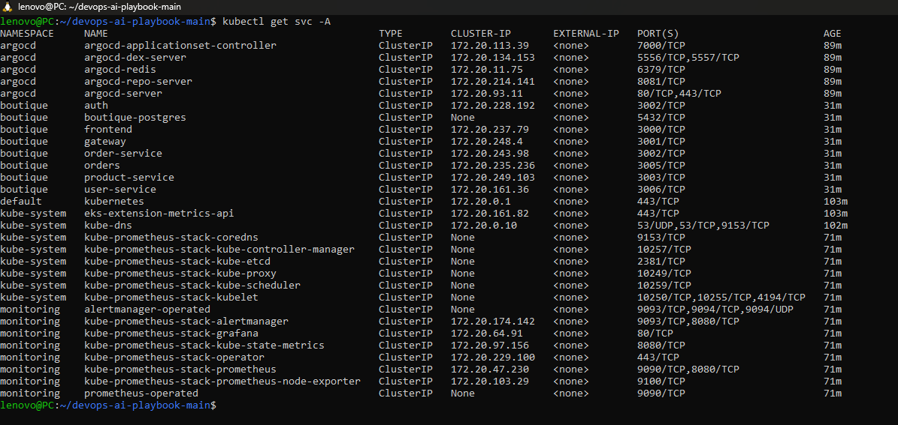

---

# ArgoCD + GitOps

### ArgoCD Dashboard

ArgoCD implemented GitOps workflows for Kubernetes deployments.

---

### GitOps Sync Success

ArgoCD automatically synchronized GitHub manifests with EKS.

Features enabled:

* Auto Sync
* Self Heal
* Auto Namespace Creation

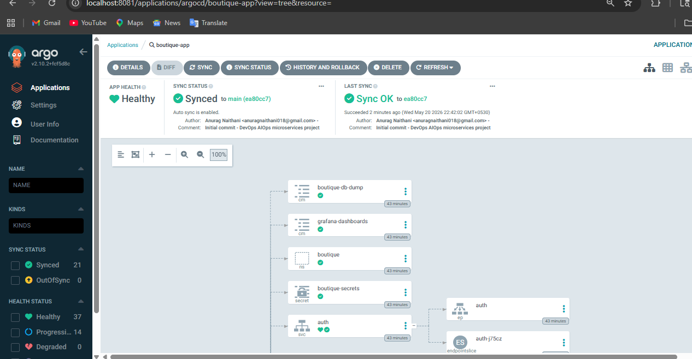

---

### ArgoCD Application Graph

The application graph visualized deployments, services, pods, and secrets.


---

# Monitoring on EKS

### Grafana Monitoring on EKS

Grafana monitored Kubernetes nodes, pods, and services.

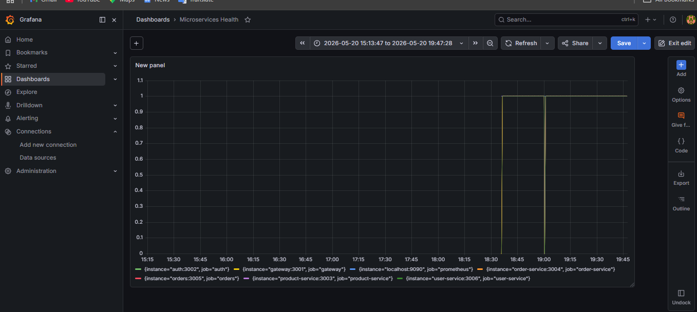

---

### Frontend Running on EKS

The frontend application was successfully accessible from AWS EKS deployment.

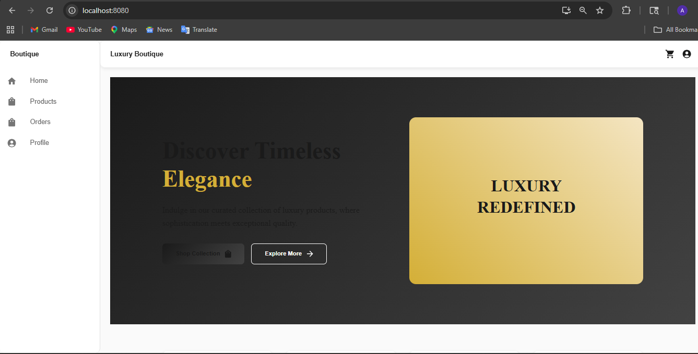

---

# Architecture Diagram

### Complete DevOps + AIOps Architecture

```text
User
 ↓
Frontend
 ↓
Gateway
 ↓
Microservices
 ↓
PostgreSQL

Monitoring:
Prometheus → Grafana

GitOps:
GitHub → ArgoCD → EKS
```
---

# Tech Stack

| Layer          | Technology                 |
| -------------- | -------------------------- |
| Application    | React, Node.js, PostgreSQL |
| Containers     | Docker, Docker Compose     |
| Orchestration  | Kubernetes (AWS EKS)       |
| Infrastructure | Terraform                  |
| CI/CD          | GitHub Actions             |
| GitOps         | ArgoCD + Kustomize         |
| Monitoring     | Prometheus + Grafana       |
| AIOps          | AWS Bedrock Agent          |
| AI Assistant   | Claude Code + MCP Servers  |

---

# Key Features

* End-to-End DevOps Workflow
* Microservices Architecture
* Kubernetes Deployment on AWS EKS
* GitOps Automation using ArgoCD
* Infrastructure as Code using Terraform
* Monitoring using Prometheus & Grafana
* Dockerized Services
* AWS ECR Integration
* CI/CD Pipeline Ready
* Real-world Troubleshooting & Debugging

---

# Real-World Problems Solved

During implementation, multiple real-world DevOps issues were identified and resolved:

* Docker Compose setup issues
* Frontend 403 NGINX error
* WSL and Node.js conflicts
* Prometheus no-data troubleshooting
* Grafana datasource configuration
* AWS ECR authentication issues
* Terraform EKS provisioning errors
* ArgoCD synchronization problems
* Kubernetes CrashLoopBackOff debugging
* PostgreSQL database creation issues
* Invalid Docker image references
* Pending Kubernetes pods
* AWS infrastructure cleanup and cost optimization

---

# Project Status

✅ Successfully Completed
